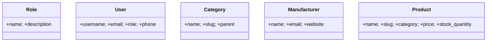

## Диаграмма классов (7 уровней): пошаговая инструкция с таблицами данных

Ниже — как самостоятельно построить UML‑диаграмму классов для проекта, двигаясь от простого к детальному. На каждом уровне дано:
- краткая цель уровня;
- таблицы с данными (заполнять не нужно — уже предзаполнено из `paint_shop_project/models.py`);
- при необходимости — инкрементальная вставка в `docs/uml/class_diagram.mmd` (Mermaid).

Итог: к концу уровня 7 вы получите актуальную диаграмму в `.mmd`, PNG и при желании — `.drawio`.

---

### Уровень 1. Контекст: список доменных классов по подсистемам
Цель: увидеть «карту местности» — какие сущности вообще есть.

Подсистемы и классы:

| Подсистема | Классы |
| --- | --- |
| Учет и пользователи | Role, User |
| Каталог | Category, Manufacturer, Product |
| Корзина и заказ | Cart, Order, OrderItem, OrderStatusHistory |
| Доставка и оплата | Delivery, Payment |
| Отзывы | Review |
| Акции и промо | Promotion, UserPromotion, Discount, PromoCode |
| Лояльность и кешбэк | LoyaltyCard, LoyaltyTransaction, Favorite, FavoriteCategory, CashbackTransaction |
| Витрина/история | SearchHistory, ViewHistory |
| Уведомления и поддержка | Notification, EmployeeRating, SupportTicket, SupportResponse |
| Спец‑разделы | SpecialSection, UserSpecialSection |
| Служебные | ErrorLog, PhoneVerification, Store |

Инкремент для Mermaid (скелет):


---

### Уровень 2. Ключевые поля классов (ядро)
Цель: для каждого класса зафиксировать «паспорт» — важные поля с типами и ограничениями.

Подсказка: поля перечислены кратко; второстепенные можно добавить на уровне 5.

| Класс | Поле | Тип | Ограничения/диапазоны | Примечание |
| --- | --- | --- | --- | --- |
| Role | name | Char(choices) | unique | admin/manager/courier/customer |
| Role | description | Text | optional |  |
| User | role | FK(Role) | PROTECT, null/blank |  |
| User | phone | Char(20) | blank |  |
| User | address | Text | blank |  |
| User | birth_date | Date | null/blank |  |
| User | avatar | Image | null/blank |  |
| User | preferred_delivery_time | Char(50) | blank |  |
| User | notification_preferences | JSON | default={} |  |
| User | total_cashback_earned | Decimal(10,2) | default=0 |  |
| User | total_cashback_spent | Decimal(10,2) | default=0 |  |
| User | is_newsletter_subscribed | Bool | default=True |  |
| User | registration_source | Char(50) | default=website |  |
| Manufacturer | name | Char(200) | required |  |
| Manufacturer | email | Email | blank |  |
| Manufacturer | website | URL | blank |  |
| Product | name | Char(200) | required |  |
| Product | slug | Slug | unique |  |
| Product | category | FK(Category) | CASCADE |  |
| Product | manufacturer | FK(Manufacturer) | CASCADE, null/blank |  |
| Product | price | Decimal(10,2) | MinValue≥0 |  |
| Product | old_price | Decimal(10,2) | null/blank, MinValue≥0 |  |
| Product | stock_quantity | PositiveInteger | default=0 |  |
| Product | unit | Char(choices) | default='шт' |  |
| Product | weight | Char(50) | blank |  |
| Product | image | Image | null/blank |  |
| Product | rating | Decimal(3,2) | 0..5 |  |
| Product | has_expiry_date | Bool | default=False |  |
| Product | expiry_date | Date | null/blank |  |
| Product | production_date | Date | null/blank |  |
| Product | shelf_life_days | PositiveInteger | null/blank |  |
| Category | name | Char(100) | required |  |
| Category | slug | Slug | unique |  |
| Category | parent | FK(self) | CASCADE, null/blank | древовидность |
| Cart | user | FK(User) | CASCADE | unique_together(user,product) |
| Cart | product | FK(Product) | CASCADE |  |
| Cart | quantity | PositiveInteger | Min≥1 |  |
| Order | user | FK(User) | CASCADE |  |
| Order | status | Char(choices) | created/confirmed/... |  |
| Order | delivery_type | Char(choices) | delivery/pickup |  |
| Order | pickup_point | FK(Store) | PROTECT, null/blank |  |
| Order | delivery_address | Text | blank |  |
| Order | total_amount | Decimal(10,2) | Min≥0 |  |
| Order | payment_method | Char(choices) | card/online/cash |  |
| Order | favorite_discount_amount | Decimal(10,2) | default=0 |  |
| Order | promotion_discount | Decimal(10,2) | default=0 |  |
| Order | delivery_cost | Decimal(10,2) | default=0 |  |
| OrderItem | order | FK(Order) | CASCADE | unique_together(order,product) |
| OrderItem | product | FK(Product) | CASCADE |  |
| OrderItem | quantity | PositiveInteger | Min≥1 |  |
| OrderItem | price_per_unit | Decimal(10,2) | Min≥0 |  |
| OrderStatusHistory | order | FK(Order) | CASCADE |  |
| OrderStatusHistory | status | Char(choices) | как в Order |  |
| Delivery | order | OneToOne(Order) | CASCADE | 1:1 |
| Delivery | courier | FK(User) | PROTECT |  |
| Delivery | status | Char(choices) | assigned/in_transit/delivered |  |
| Payment | order | FK(Order) | CASCADE |  |
| Payment | amount | Decimal(10,2) | Min≥0 |  |
| Payment | status | Char(choices) | success/error/refund |  |
| Review | user | FK(User) | CASCADE | unique(user,product) |
| Review | product | FK(Product) | CASCADE |  |
| Review | rating | PositiveInteger | 1..5 |  |
| Promotion | name | Char | required |  |
| Promotion | discount_type | Char | percentage/fixed |  |
| Promotion | discount_value | Decimal | >=0 |  |
| UserPromotion | user | FK(User) | CASCADE | unique(user,promotion,order) |
| UserPromotion | promotion | FK(Promotion) | CASCADE |  |
| UserPromotion | order | FK(Order) | CASCADE |  |
| Discount | product | FK(Product) | CASCADE |  |
| Discount | discount_percent | PositiveInteger | 1..100 |  |
| PromoCode | code | Char | unique |  |
| PromoCode | discount_type | Char | percent/fixed |  |
| PromoCode | used_count | PositiveInteger | default=0 | < max_uses |
| LoyaltyCard | user | OneToOne(User) | CASCADE | 1:1 |
| LoyaltyCard | card_number | Char | unique |  |
| LoyaltyCard | points | PositiveInteger | default=0 |  |
| LoyaltyTransaction | card | FK(LoyaltyCard) | CASCADE |  |
| LoyaltyTransaction | transaction_type | Char | earned/spent/bonus/refund |  |
| Favorite | user | FK(User) | CASCADE | unique(user,product) |
| Favorite | product | FK(Product) | CASCADE |  |
| FavoriteCategory | user | FK(User) | CASCADE | unique(user,category) |
| FavoriteCategory | category | FK(Category) | CASCADE |  |
| FavoriteCategory | cashback_multiplier | Decimal(3,2) | default=2.0 |  |
| FavoriteCategory | discount_percent | PositiveInteger | 0..50 |  |
| CashbackTransaction | user | FK(User) | CASCADE |  |
| CashbackTransaction | order | FK(Order) | CASCADE |  |
| Notification | user | FK(User) | CASCADE |  |
| EmployeeRating | user | FK(User) | CASCADE |  |
| EmployeeRating | order | FK(Order) | CASCADE |  |
| SupportTicket | user | FK(User) | CASCADE |  |
| SupportResponse | ticket | FK(SupportTicket) | CASCADE |  |
| SupportResponse | user | FK(User) | CASCADE |  |
| SpecialSection | name | Char | required |  |
| UserSpecialSection | user | FK(User) | CASCADE | unique(user,section) |
| UserSpecialSection | section | FK(SpecialSection) | CASCADE |  |
| ErrorLog | error_type | Char(choices) | required |  |
| ErrorLog | user | FK(User) | SET_NULL | null/blank |
| PhoneVerification | phone | Char | required |  |
| Store | manager | FK(User) | PROTECT |  |

Инкремент для Mermaid (показать ключевые атрибуты на примере 5 классов):



---

### Уровень 3. Связи и кардинальности
Цель: зафиксировать направление и мощность связей, а также политику удаления.

| От | К | Тип | Кардинальность | on_delete |
| --- | --- | --- | --- | --- |
| User | Role | FK | многие→1 | PROTECT |
| Category | Category | FK(self) | многие→1 | CASCADE |
| Product | Category | FK | многие→1 | CASCADE |
| Product | Manufacturer | FK | многие→1 | CASCADE |
| Cart | User | FK | многие→1 | CASCADE |
| Cart | Product | FK | многие→1 | CASCADE |
| Order | User | FK | многие→1 | CASCADE |
| OrderItem | Order | FK | многие→1 | CASCADE |
| OrderItem | Product | FK | многие→1 | CASCADE |
| OrderStatusHistory | Order | FK | многие→1 | CASCADE |
| Delivery | Order | OneToOne | 1→1 | CASCADE |
| Delivery | User | FK(courier) | многие→1 | PROTECT |
| Payment | Order | FK | многие→1 | CASCADE |
| Review | User | FK | многие→1 | CASCADE |
| Review | Product | FK | многие→1 | CASCADE |
| Favorite | User | FK | многие→1 | CASCADE |
| Favorite | Product | FK | многие→1 | CASCADE |
| FavoriteCategory | User | FK | многие→1 | CASCADE |
| FavoriteCategory | Category | FK | многие→1 | CASCADE |
| LoyaltyCard | User | OneToOne | 1→1 | CASCADE |
| LoyaltyTransaction | LoyaltyCard | FK | многие→1 | CASCADE |
| CashbackTransaction | User | FK | многие→1 | CASCADE |
| CashbackTransaction | Order | FK | многие→1 | CASCADE |
| Store | User | FK(manager) | многие→1 | PROTECT |
| Order | Store | FK(pickup_point) | многие→1 | PROTECT |
| SearchHistory | User | FK | многие→1 | CASCADE |
| ViewHistory | User | FK | многие→1 | CASCADE |
| ViewHistory | Product | FK | многие→1 | CASCADE |
| Notification | User | FK | многие→1 | CASCADE |
| EmployeeRating | User | FK | многие→1 | CASCADE |
| EmployeeRating | Order | FK | многие→1 | CASCADE |
| SupportTicket | User | FK | многие→1 | CASCADE |
| SupportTicket | Order | FK | многие→1 | SET_NULL |
| SupportResponse | SupportTicket | FK | многие→1 | CASCADE |
| SupportResponse | User | FK | многие→1 | CASCADE |
| UserSpecialSection | User | FK | многие→1 | CASCADE |
| UserSpecialSection | SpecialSection | FK | многие→1 | CASCADE |
| UserPromotion | User | FK | многие→1 | CASCADE |
| UserPromotion | Promotion | FK | многие→1 | CASCADE |
| UserPromotion | Order | FK | многие→1 | CASCADE |
| Discount | Product | FK | многие→1 | CASCADE |
| ErrorLog | User | FK | многие→1 | SET_NULL |
| PhoneVerification | User | логическая | n/a | по телефону |

Инкремент для Mermaid (стрелки):


---

### Уровень 4. Черновая диаграмма: группировка по подсистемам
Цель: получить цельную, но черновую диаграмму и сгруппировать сущности.

Шаги:
- в `docs/uml/class_diagram.mmd` добавьте комментарии блоков: Catalog, Orders, Loyalty, Support, Specials;
- разместите классы рядом внутри своего блока;
- пока без «косметики», главное — целостность связей.

Мини‑пример для блока «Catalog»:


---

### Уровень 5. Улучшение читаемости: уровни детализации
Цель: не перегружать схему. Сначала показывать только ключевые поля, второстепенные — по мере надобности.

Рекомендации:
- для перегруженных классов (`User`, `Product`, `Order`) оставьте на диаграмме ключевые поля из Уровня 2;
- второстепенные поля (например, даты аудита) временно скрывайте;
- выравнивайте блоки, минимизируйте пересечения линий;
- используйте авто‑раскладку в draw.io после импорта Mermaid.

Чек‑лист:
- [ ] Ключевые поля выделены, второстепенные скрыты в узких местах;
- [ ] Подсистемы визуально сгруппированы;
- [ ] Линии не перекрывают названия классов и атрибутов.

---

### Уровень 6. Сборка артефактов из исходников
Цель: из `.mmd` получить воспроизводимый PNG (и альтернативно — сгенерировать схему из моделей).

Вариант A: Mermaid → PNG

```bash
npx -y @mermaid-js/mermaid-cli -i docs/uml/class_diagram.mmd -o docs/uml/class_diagram.png -w 2400
```

Вариант B: Django Extensions (граф из моделей)

```bash
pip install django-extensions pygraphviz

# в paint_shop/settings.py
# INSTALLED_APPS += ["django_extensions"]

python manage.py graph_models paint_shop_project -a -g -o docs/uml/class_diagram.png
```

---

### Уровень 7. Финализация в draw.io
Цель: отшлифовать расположение и экспортировать финальные материалы.

Шаги:
1) Импортируйте `docs/uml/class_diagram.mmd` в draw.io: File → Import.
2) Разведите блоки подсистем, примените авто‑layout.
3) По необходимости раскройте второстепенные поля для нужных классов (см. Уровень 5).
4) Сохраните `docs/uml/class_diagram.drawio`.
5) Экспортируйте PNG: File → Export As → PNG (опция «Embed XML» — по желанию).

— Готово: у вас есть `.mmd`, `.png` и редактируемый `.drawio`.


